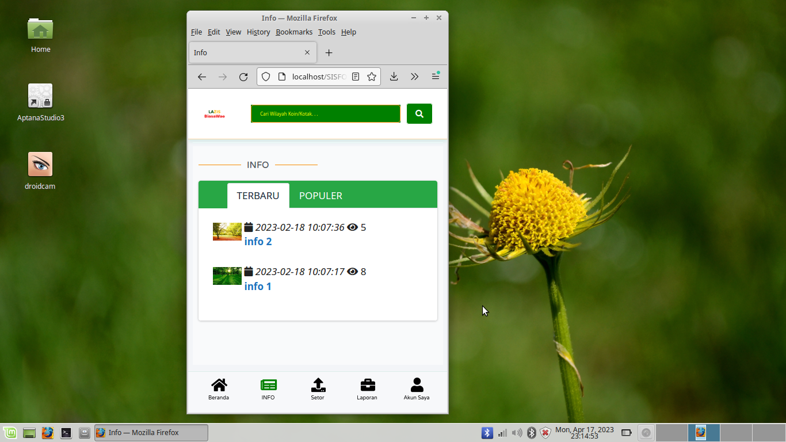
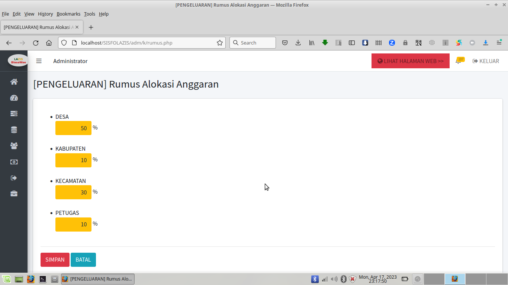

# SISFO-KEULAZIS v1.37

SISFO-KEULAZIS : Web Aplikasi / SISFO untuk Kelola Keuangan Lembaga Lazis.

Cocok untuk penggunaan dalam satu kota. Baik itu LAZISNU maupun LAZISMU.

Karena semua petugas lapangan pengumpul koin/infaq, akan dilibatkan dalam setor nominalnya. Baik dari level desa dan level kecamatan.

Penggunaan nominal/keuangan keluar, dengan rumus persen untuk petugas, desa, kecamatan, dan kabupaten/kota, juga bisa ditentukan.

Dibuat dengan Php Native Php 7.4.10 dan Mysql/MariaDB.

Pastikan gunakan Webserver XAMPP PHP 7.4.10 .

---

* Untuk File .SQL bisa import dari Folder /db

* File Konfigurasi di /inc/config.php

---

http://alamat_webnya/admin

Login Admin, Silahkan gunakan User/Password : admin

---

http://alamat_webnya

Login petugas, Silahkan gunakan User/Pass : 1234567890

---

TAMPILAN HALAMAN WEB SISFO-KEULAZIS :

---

Unduh di :

https://gitlab.com/hajirodeon/sisfolazis

---

Bila ada kesulitan atau hambatan atau ingin request custom konten berbayar, 

silahkan bisa kontak via email : hajirodeon@gmail.com 

atau WA : 081-829-88-54

